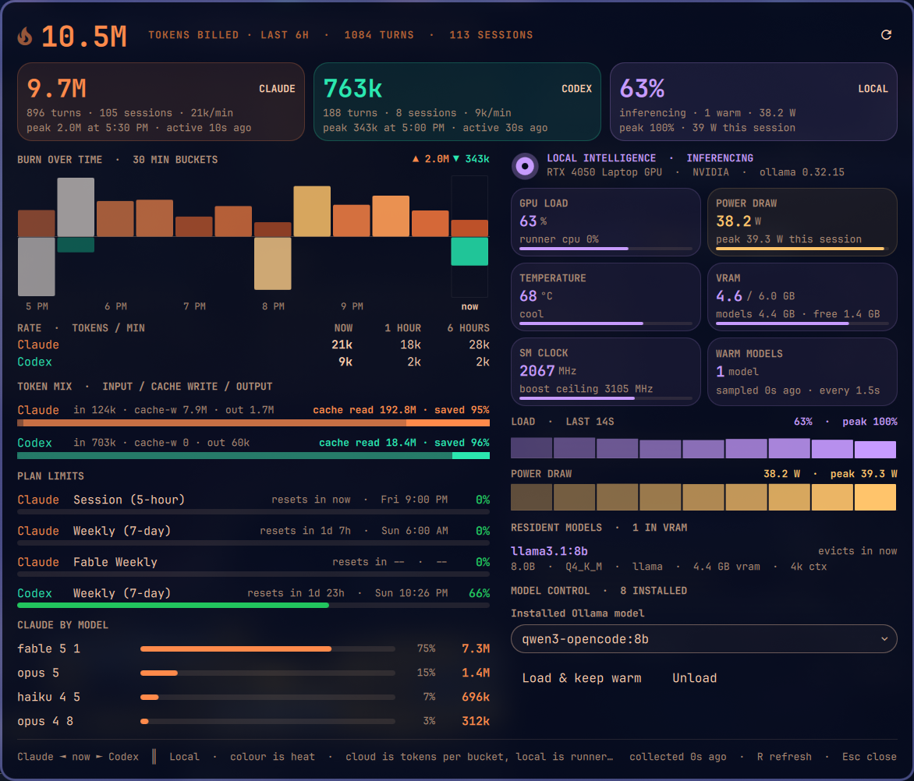
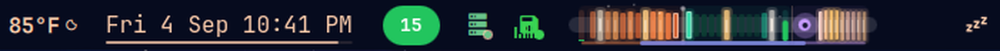

# Burn Bar

An Omarchy bar widget that renders every model you run — Claude, Codex and
local Ollama — as one live thermal instrument in a single bar slot, with a
click-to-open cockpit that shows what, how much, how fast, how close to the
plan limit, and what the GPU is doing about it.



Everything in that screenshot is real and local: 10.5M tokens billed in six
hours across 113 sessions, a cache that served 192.8M reads, and an RTX 4050
holding one warm model at 38 W. Nothing was drawn by hand.

## Install

```sh
omarchy plugin add https://github.com/nixfred/burnbar.git --enable
```

Pick a bar section when asked (it defaults to `center`). Later:

```sh
omarchy plugin update nixfred.burnbar     # pull the latest
omarchy plugin remove nixfred.burnbar     # take it out again
```

Requirements: a stock Omarchy install. `python3` is already there. Optional:
Ollama for the local lane (it reads OFFLINE without it), `nvidia-smi` for full
GPU telemetry or `rocm-smi` for utilisation only. No Codex? That lane simply
stays cold.

Read [SECURITY.md](SECURITY.md) before installing. Burn Bar opens your Claude
and Codex transcripts to count tokens. It keeps only numbers.

## The strip



```
CLAUDE ◄── time ──┤ now ├── time ──► CODEX  ║  LOCAL ──► seconds
```

Claude burns on the left, Codex on the right, and the newest bucket for **both**
sits against the centre divider — so the divider is always "now" and time
radiates outward. The two agents read as one instrument instead of two widgets
that happen to be adjacent.

Colour carries the token count, on a ramp that runs cold ember → agent colour →
amber → white-hot. Both agents converge on the same white at the top, because a
maxed-out burst should look equally alarming whoever caused it. Height is only a
secondary swell (72%→100%) so the strip has a profile without stealing the story
from colour.

The two thin columns bookending the cloud lanes measure something different
entirely — percent of the weekly plan limit — and are drawn in a deliberately
different visual language so the two scales are never confused. They pulse
above 90%.

Right of a hard rule sits the **local intelligence** lane: a reactor core plus a
violet strip of live Ollama runner load. It is deliberately narrower than a
third of the widget, because free local compute must never read at the same
weight as metered cloud spend — and it is on a different clock entirely
(percent per second, not tokens per half hour).

Each section carries a tinted plate and a baseline in its own identity hue —
Claude orange, Codex teal, local violet. Hovering a section brightens it and
shows a tooltip for **that agent only**: totals, the current bucket, session
count and weekly quota for the cloud lanes; state, load, backend, resident
model and warm-model count for local.

| Input | Does |
|---|---|
| Hover a section | Tooltip for that agent alone |
| Left click | Opens the cockpit |
| Middle click | Forces a fresh collector run and a local poll |

Motion is data, never decoration:

| Effect | Means |
|---|---|
| Ember flicker | scales with each cell's own heat — cold coals sit still |
| Impact shockwave | a band riding outward from the now line: new burn just landed |
| Rising sparks | density and speed follow total energy across all three agents |
| White-hot filament | a cell that is genuinely at the top of the ramp |
| Reactor pulse | a local model is inferencing; the halo inflates with load |
| Idle drift | a slow travelling swell, so calm never looks broken |
| Solid red | fault. No idle animation, so an outage cannot hide |

## The cockpit

Left click the strip. The panel is two columns at a fixed width, fitted to its
content, and it never scrolls — the whole instrument is one glance. Left is
metered cloud spend in tokens; right is the local runner in watts, degrees and
megabytes. Different money, different units, so they never share a column.
Everything grows into place on open, then moves only when the data does.

**Header** — tokens billed in the history window, turns and sessions across
both cloud agents, and a refresh button.

**Three tiles** — Claude, Codex and Local, each with its own hue: turns,
sessions, tokens per minute, when the peak bucket happened, and how long ago
the agent was last active. The local tile shows state, warm-model count and
watts, plus the session's peak load and power.

**Cloud column**

- *Burn over time* — Claude grows upward, Codex downward, one bar per bucket,
  coloured on the same heat ramp as the strip. Hour labels underneath, the
  peak of each agent flagged at the top right, and the live bucket breathes
  until the window rolls.
- *Rate* — tokens per minute for each agent over three horizons: the current
  bucket, the last hour and the whole window.
- *Token mix* — input, cache write and output per agent, with cache reads on
  their own line and the percentage of everything the model touched that the
  cache absorbed. Cache reads are the cheap path; keeping them out of the
  heat map but visible here is deliberate.
- *Plan limits* — every limit Omarchy's agent-usage records track (Claude
  session, weekly and any extra weekly buckets; Codex weekly), each with a
  countdown, the wall-clock reset time and a percentage bar.
- *Claude by model* — spend split by model with share bars, so you can see
  which model actually ate the window.

**Local column**

- GPU name, backend (`nvidia` / `rocm`) and Ollama version.
- Six tiles: GPU load with the runner's CPU share, power draw with the
  session peak, temperature with a plain-language state, VRAM used of total
  with the models' share and what is free, SM clock against the board's boost
  ceiling, and warm-model count with sample age and poll interval.
- Load and power traces, one cell per sample, coloured by intensity.
- *Resident models* — everything Ollama currently holds in VRAM: parameter
  count, quantisation, family, VRAM footprint, context length, and "evicts
  in", read from Ollama's own `expires_at`.
- *Model control* — pick any installed model and **Load & keep warm**
  (`keep_alive: -1`) or **Unload** (`keep_alive: 0`) without leaving the bar.

Inside the panel `R` forces a refresh and `Esc` closes it. Telemetry fields
the board does not expose (nvidia-smi prints `[N/A]`) read as zero and hide,
so an AMD card or a headless box shows a shorter local column rather than a
column of dashes.

## Where the numbers come from

`bin/burnbar-collect` (Python 3, standard library only) reads the raw
transcripts, the only place per-turn token deltas with timestamps actually
live:

- **Claude** — `~/.claude/projects/**/*.jsonl`, assistant lines carry
  `message.usage`. The same message is re-serialized up to 3× as it streams, so
  `message.id` is the mandatory dedupe key. Counts fresh input + cache writes +
  output; cache *reads* are excluded from the heat map as the cheap path that
  would swamp the graph, and carried separately for the token-mix line.
- **Codex** — `~/.codex/sessions/YYYY/MM/DD/rollout-*.jsonl`, `event_msg` lines
  where `payload.type === "token_count"` carry `info.last_token_usage`, already
  a per-turn delta.
- **Limits** — read straight off the records `omarchy-agent-usage-update` keeps
  in `~/.local/state/omarchy/agents/usage/`.

Every point carries the input / cache-write / output / cache-read split, and the
collector reports turns, first and last activity and the peak bucket per
agent, which is what the cockpit's tiles and token-mix lines are built from.

Output goes to `~/.local/state/omarchy/burnbar/history.json`. State deliberately
never lives inside the plugin directory: a plugin writing in its own dir makes
Omarchy rebuild every plugin service.

Scanning is incremental twice over: a file whose size and mtime are unchanged
replays its cached contribution, and a file that merely grew is read from the
previous byte offset rather than re-parsed whole. Cold run ~2s, warm ~120ms,
which is what makes a 5-second refresh reasonable.

**Local** — `bin/burnbar-local-status` asks Ollama's `/api/ps` what is resident
and `/api/version` which build is running, samples runner CPU ticks from
`/proc`, and reads utilisation, power, temperature, VRAM and clocks from
`nvidia-smi` (or utilisation alone from `rocm-smi`). Nothing about local load
is persisted anywhere, so the service keeps its own rolling ring of samples —
that ring *is* the local lane and the cockpit's traces.
`bin/burnbar-local-control` lists installed models via `/api/tags` and warms
or evicts one through `/api/generate` with `keep_alive`.

Python 3 with no third-party imports is deliberate. Omarchy depends on `uwsm`
and `kitty`, both of which depend on `python`, so `python3` is present on every
Omarchy install; `bun` is not an Omarchy dependency and cannot be assumed.
Version 1.0 shipped its collector on bun and rendered nothing on a stock
install, silently. That is why 1.1 exists.

If the collector cannot run, the strip turns solid red and the tooltip says why.
A wedged run is killed by a 30-second watchdog. It never fails silently.

## Privacy

Burn Bar reads your Claude and Codex transcripts to count tokens, and keeps only
numbers from them. Its only network traffic is to your own Ollama endpoint
(`OLLAMA_HOST`, default `http://127.0.0.1:11434`) to read and control local
models; nothing leaves the machine. Read [SECURITY.md](SECURITY.md) before
installing.

## Settings

Set from the Omarchy plugin settings UI, or in `shell.json`.

| Key | Default | Meaning |
|---|---|---|
| `width` | 158 | Widget width in px |
| `bars` | 12 | Cells per cloud agent (the collector makes exactly this many buckets) |
| `windowMinutes` | 360 | How far back the cloud lanes and the cockpit chart reach |
| `refreshIntervalSec` | 5 | Collector cadence |
| `showGauges` | true | Weekly quota columns bookending the cloud lanes |
| `showLocal` | true | Show the local intelligence lane |
| `localCells` | 9 | Cells in the local lane (= length of the sample ring) |
| `localRefreshMs` | 1500 | Local runner poll interval |
| `localThreshold` | 8 | Runner load above this counts as actively inferencing |
| `emberFlicker` | true | Live flicker on hot cells |
| `sparks` | true | Rising embers while anything is burning |

Bucket length is `windowMinutes / bars`, so the defaults give twelve 30-minute
buckets on the strip and the same twelve in the cockpit chart.

## Tests

```sh
./tests/test.sh
```

Validates the manifest, asserts cell count equals bucket count and local cell
count equals ring length, runs the Ollama URL/JSON hardening unit tests, checks
that the local probe degrades to a clean offline object, and runs the collector
against a synthetic fixture that checks `message.id` dedupe, cache-read
exclusion, Codex delta math, cache idempotency, and the tail read.

## Changes

See [CHANGELOG.md](CHANGELOG.md). Current version: 1.3.0.

## Credits

Omarchy is [DHH](https://github.com/dhh)'s and Basecamp's desktop; Burn Bar is
a plugin on top of it and claims none of the underlying shell. The local lane
grew out of the earlier `local-intelligence` plugin and absorbed it in 1.2.0.
Written by Larry, an AI that lives on the laptop in the screenshot, with Fred
Nix. MIT.
