# Burn Bar

An Omarchy bar widget for everyone paying for more than one AI subscription. It
reads what **this machine actually uses** (Claude, Codex, Grok, Kimi, and local
Ollama when a compute GPU is present) and turns it into one live thermal strip
in the bar, plus a click-to-open cockpit. Since 2.1 it does not stop at data: it
tells you **what to do**. Which sub has budget in the bank, which one needs a
rest and until when, and which one to reach for next.

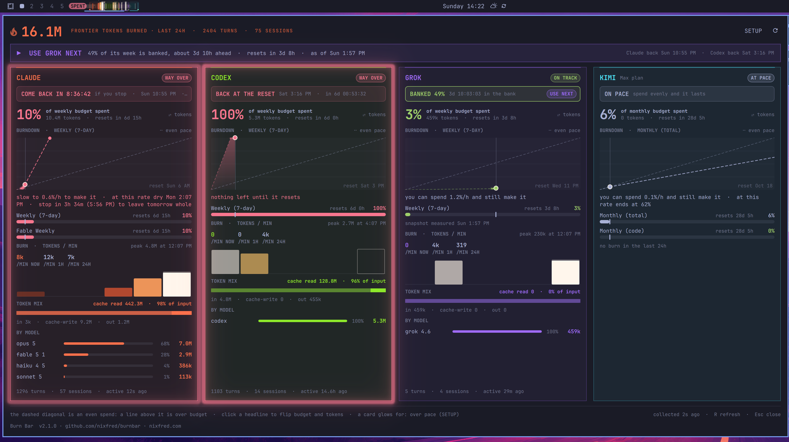

Everything in these screenshots is real. They were captured from the plugin
itself, running on one day of recorded usage from the author's own machine:
16.1M tokens in 24 hours across 2,404 turns and 75 sessions. Claude had spent
10% of its week with 5% of the week gone. Codex was at 100% with six days still
to run. Grok had spent 3% with half its week behind it. Nothing was drawn by
hand; the captions and callouts are the only things added.

## What it tells you to do

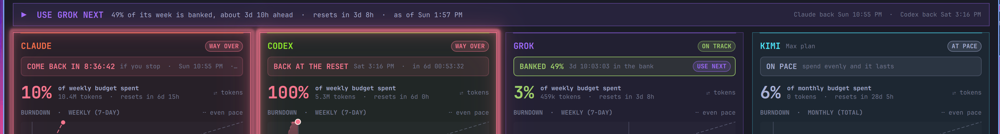

Budget means an **even spend across the window**. Two numbers decide
everything: how much of the plan is used, and how much of the clock. From those:

- **BANKED 49%**, with a clock: `3d 10:03:03 in the bank`. You are ahead. The
  figure is the share of the plan an even spend would have used by now and you
  did not. Leave a sub alone and the clock climbs a second every second, which
  is what "take time off and it comes back to budget" looks like. Shown only
  when you are ahead, never when you are behind.
- **COME BACK IN 8:36:42**, `if you stop · Sun 10:55 PM · 5% over`. You are
  behind. It counts down to the moment the even-spend line catches up with what
  you have already burned. The condition is printed because it is a promise that
  only holds if you stop.
- **BACK AT THE RESET**, with the reset and a countdown. The plan is spent, and
  nothing brings it back sooner.
- **ON PACE**. Within 5% of an even spend. Carry on.

Above the cards, one banner answers the question you actually opened the panel
with: **USE GROK NEXT**, and why (`49% of its week is banked, about 3d 10h
ahead · resets in 3d 8h`), then who is next and when each resting sub is back.
When a reset is close with budget unspent it becomes **USE GROK NOW: use it or
lose it**. When you are already burning the right one it says **KEEP USING
GROK** instead of telling you to switch to what you are on.

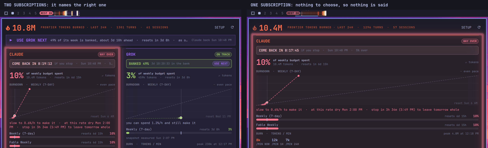

The rules it keeps, so the advice is worth acting on:

- **It needs a choice.** Two or more subscriptions, or it says nothing. One sub
  leaves nothing to choose between.
- **Never the local GPU.** This is about where you stand on your plans, not
  about where work should run.
- **Only a sub that is ahead is ever suggested.** The winner is the one with the
  most plan left against the clock it has left, which compares a week and a
  month on the same scale and turns into earliest-deadline-first as a reset
  nears.
- **A lane you unticked is left out.** No card, no cells, no badge, no advice.
- **A full 5-hour session window blocks a sub**, even with its week wide open,
  and so does one that will be full inside half an hour. Sending you into a
  wall is not guidance.
- **A snapshot is not treated as exact.** Grok only reports its quota when Grok
  starts, so that figure needs five times the margin before it is suggested,
  more again once Grok has been used since, and the words say when it was
  measured (`as of Sun 1:50 PM, used since`, and `BANKED ~49%`).
- **The clocks hold still while you burn.** A provider's percentage only moves
  when it is re-measured, so running the clock past that moment would let
  "banked" climb and then jump back. It ticks while you rest and holds while
  you work.
- **It does not flap.** The current pick keeps the job until another is clearly
  better, not better by a rounding.

## Install

```sh
omarchy plugin add https://github.com/nixfred/burnbar.git --enable
```

Pick a bar section when asked (it defaults to `center`). Later:

```sh
omarchy plugin update nixfred.burnbar     # pull the latest
omarchy plugin remove nixfred.burnbar     # take it out again
```

Requirements: a stock Omarchy install. `python3` is already there. Burn Bar
detects which AIs you use from their transcripts (`~/.claude/projects`,
`~/.codex/sessions`, `~/.grok/sessions`) and only draws those lanes. No
Codex? That lane is omitted, not left cold. The local GPU lane appears only
when a **compute GPU** is detected: NVIDIA, AMD, or a Jetson. Intel
integrated graphics does not count. Default Ollama is this machine
(`http://127.0.0.1:11434`). For a Jetson on the tailnet set `localHost` to
`nano` and `ollamaUrl` to `http://nano:11434`, with `ssh nano` logging in
without a prompt and `./nano/install.sh` run once for the token meter.
Horizontal bars only: the strip lays its lanes across the bar's length and
does not rotate for a left or right bar.

Read [SECURITY.md](SECURITY.md) before installing. Burn Bar opens your Claude
and Codex transcripts to count tokens. It keeps numbers, model names and
message ids from them, never text, and it triggers Omarchy's own usage
collectors, which contact your providers with the sign-ins you already have.

## The strip

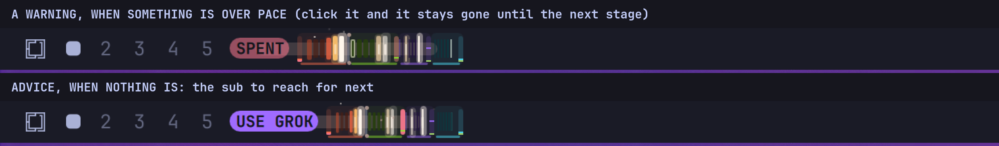

The chip beside the cells speaks guidance, not multipliers. While a sub is past
an even spend it says what to do about it: `CLAUDE  REST 8H`, or `SPENT`. Click
it and it fades, and stays gone until that sub reaches a worse stage or its
window rolls over. With nothing to warn about it names the sub to use next, in
that sub's colour. Turn the advice off in SETUP if you only want warnings.

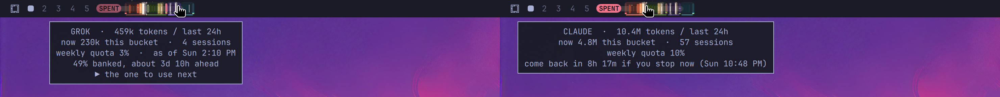


```
CLAUDE ◄── time ──┤ now ├── time ──► CODEX  │  GROK ──►  ║  NANO ──► seconds
```

Claude burns on the left, Codex on the right, Grok after Codex, and the newest bucket for the mirrored pair
sits against the centre divider, so the divider is always "now" and time
radiates outward. The two agents read as one instrument instead of two widgets
that happen to be adjacent.

Colour carries the token count, on a ramp that runs cold ember → agent colour →
amber → white-hot. Both agents converge on the same white at the top, because a
maxed-out burst should look equally alarming whoever caused it. Height is only a
secondary swell (72%→100%) so the strip has a profile without stealing the story
from colour.

The two thin columns bookending the cloud lanes measure something different
entirely, percent of the weekly plan limit, and are drawn in a deliberately
different visual language so the two scales are never confused. They pulse
above 90%.

Right of a hard rule sits the **local intelligence** lane: a reactor core plus a
violet strip of live load on the Ollama box. It is deliberately narrower than
a third of the widget, because free local compute must never read at the same
weight as metered cloud spend, and it is on a different clock entirely
(percent per second, not tokens per half hour).

Each section carries a tinted plate and a baseline in its own identity hue,
Claude orange, Codex teal, local violet. Hovering a section brightens it and
shows a tooltip for **that agent only**: totals, the current bucket, session
count and weekly quota for the cloud lanes; state, load, backend, resident
model and warm-model count for local.

| Input | Does |
|---|---|
| Hover a section | Tooltip for that agent alone |
| Left click | Opens the cockpit |
| Middle click | Forces a fresh collector run and a local poll |

Motion is data, never decoration:

| Effect | Means |
|---|---|
| Ember flicker | scales with each cell's own heat, cold coals sit still |
| Impact shockwave | a band riding outward from the now line: new burn just landed |
| Rising sparks | density and speed follow total energy across all three agents |
| White-hot filament | a cell that is genuinely at the top of the ramp |
| Reactor pulse | a local model is inferencing; the halo inflates with load |
| Idle drift | a slow travelling swell, so calm never looks broken |
| Solid red | fault. No idle animation, so an outage cannot hide |

## The cockpit

Left click the strip. A guidance banner, then one card per subscription, side
by side at equal width. The panel never scrolls and never clips: it measures the
screen it opens on and tightens itself (shorter graphs, closer rows, a one-line
footer) on a 1080p laptop, and tightens again if a plan with many quota windows
still would not fit. A subscription that is not ticked in SETUP has no card, and
one that burned nothing in the window folds its burn half down to a single line.
The local GPU is a card like the rest.

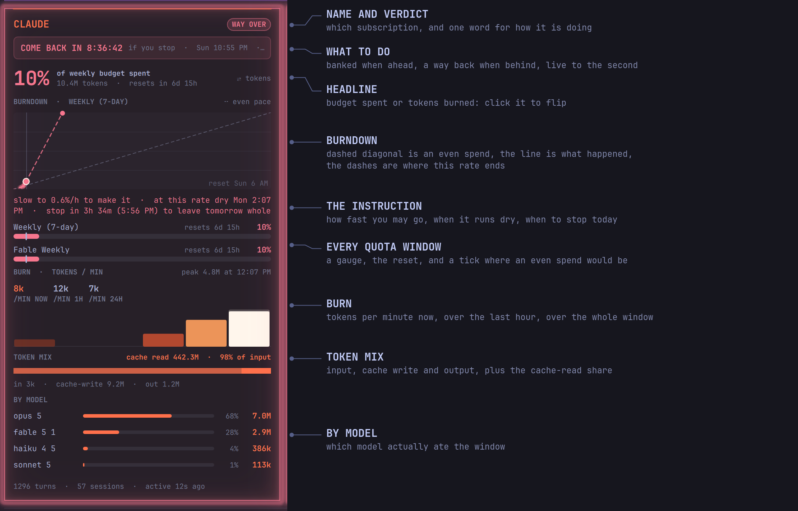

**Header.** Tokens burned in the exact trailing window (fresh input, cache
writes and output; cache reads are left out, and they are billed too, at a
lower rate), turns and sessions across every cloud agent shown, the share kept
on localhost, a SETUP button and a refresh button.

**A subscription card**, top to bottom:

- *Name and verdict.* ON TRACK, AT PACE, OVER or WAY OVER. Over starts 5% past
  an even spend, the same line the badge and the glow use, so the three never
  disagree.
- *What to do.* The line described above: banked, come back, back at the reset,
  or on pace. It leads the card because it is the first thing you want to know.
- *Headline.* Budget (how much of the plan is spent) or tokens (raw burn in
  the window). Click it to flip, or pick one in SETUP. A subscription whose
  quota cannot be measured falls back to tokens.
- *Burndown.* The dashed diagonal is an even spend across the window. The
  solid line is what actually happened, and a dashed projection carries the
  current rate to the reset or to the moment the plan runs dry. A line above
  the diagonal is over budget.
- *The instruction.* What you can spend per hour and still make it, when the
  plan runs dry at this rate, and when to stop today so tomorrow keeps its own
  share (only when today's share really would run out today).
- *Windows.* Every limit the provider reports, each with a gauge, the reset
  time and a tick for where an even spend would be. A window whose reset has
  passed reads "rolled over" with the percentage withheld, and a record that is
  stale or carries a status ("Sign-in expired") says so in red.
- *Burn.* Tokens per minute now, over the last hour and over the whole window,
  with one bar per bucket on the same heat ramp as the strip.
- *Token mix.* Input, cache write and output, with cache reads on their own
  line and their share of everything the model took in. That is a token share,
  not a cost saving.
- *By model.* Spend split by model with share bars.

The four places a subscription can stand, from the same capture:

| Behind | Spent | Ahead | On pace |
|---|---|---|---|
| 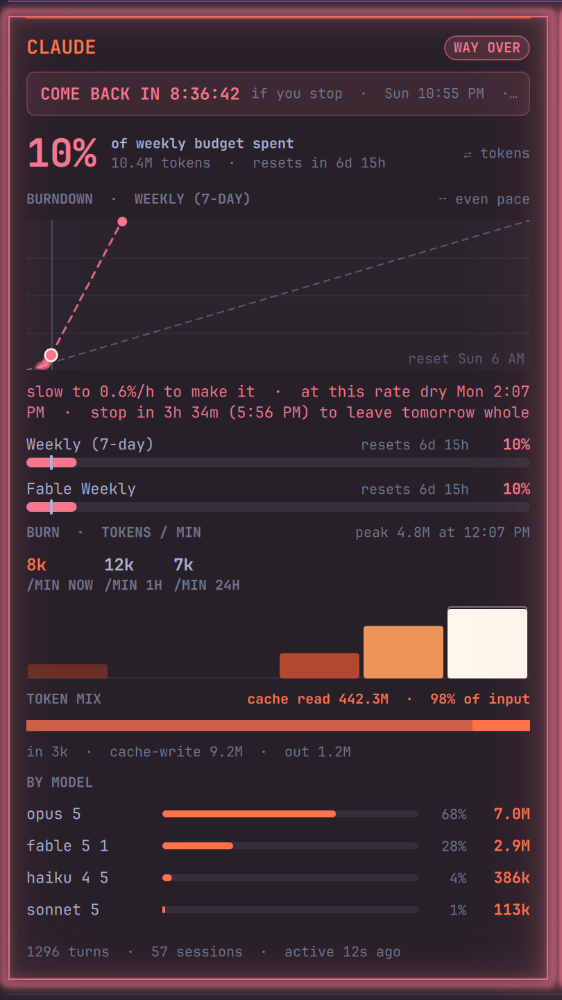 | 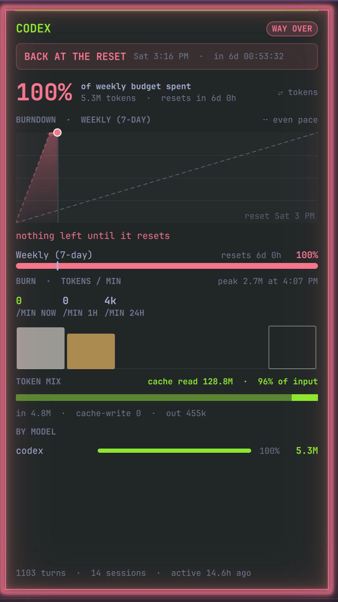 | 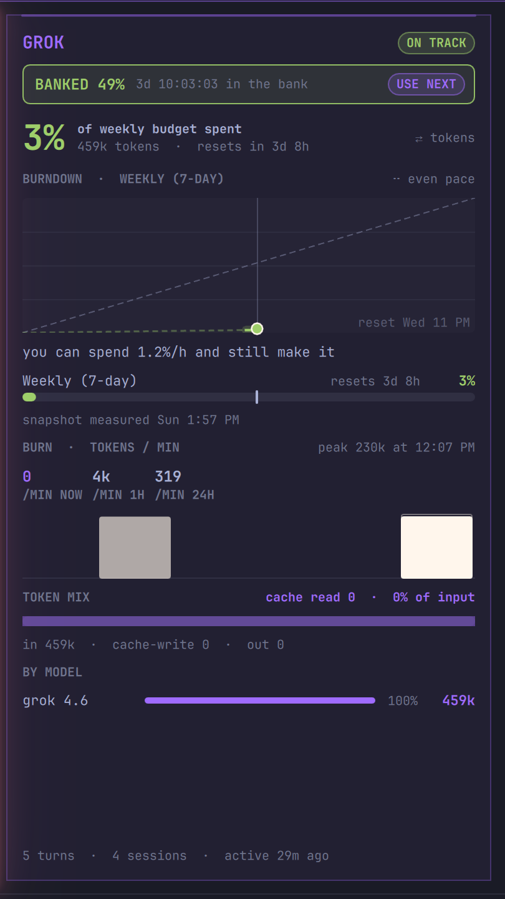 | 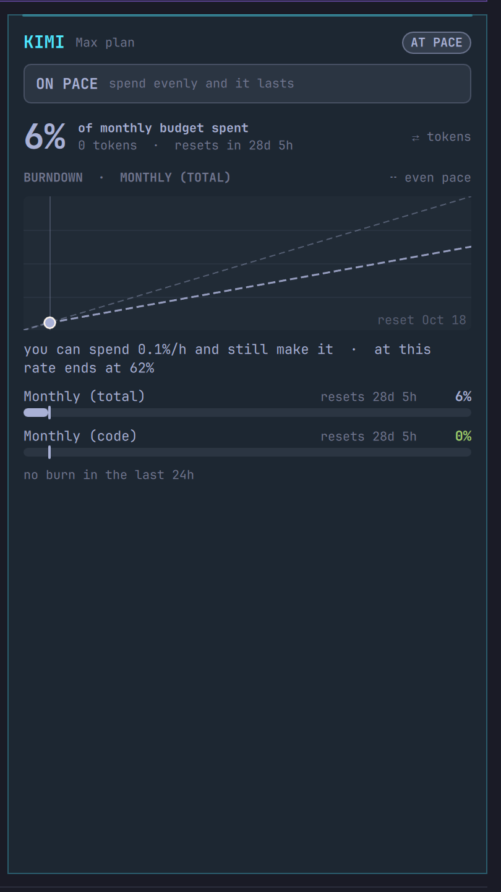 |

**Tokens instead of budget.** The same cards with the headline flipped:

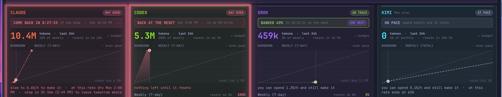

**5-hour session windows** are hidden by default, because the weekly and
monthly windows are the ones that bite. Turn them on in SETUP and they take
their place above the rest. Hidden or not, a full one still stops its sub from
being suggested.

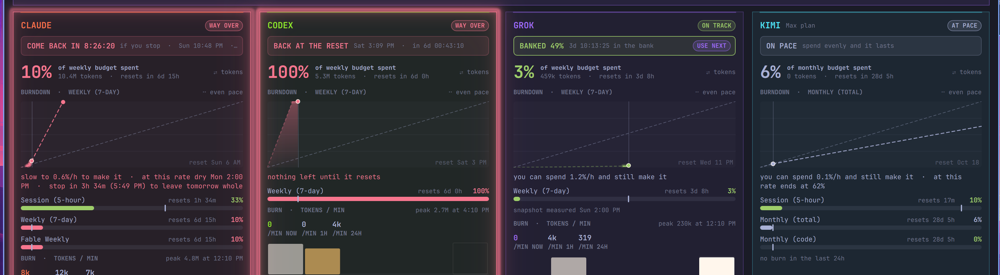

### The glow

A card lights up for one reason, which you choose in SETUP. One reason at a
time on purpose: a glow that could mean four things tells you nothing from
across the room. Over pace climbs amber to red and breathes while there is
still something to slow down; a window that is already spent burns steady.
Burning now also lights the local GPU card while the GPU is working.

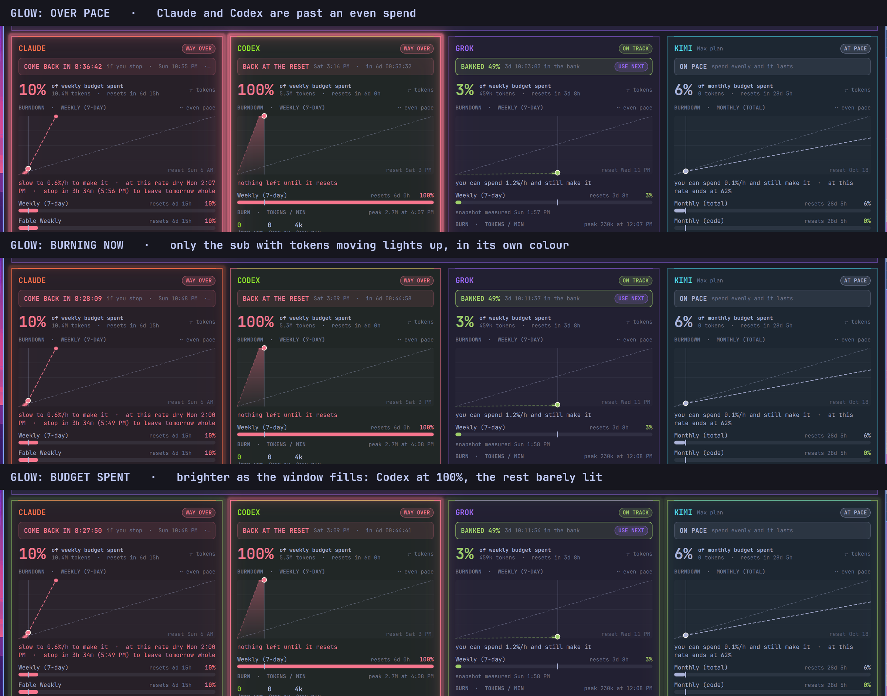

### SETUP

Every option in one place, three columns, no scrolling. Each row writes through
the bar, so it survives a restart. The notes beside each subscription are the
same guidance the cards give.

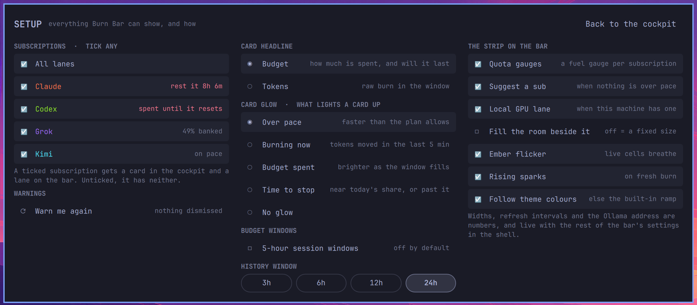

### The local GPU card

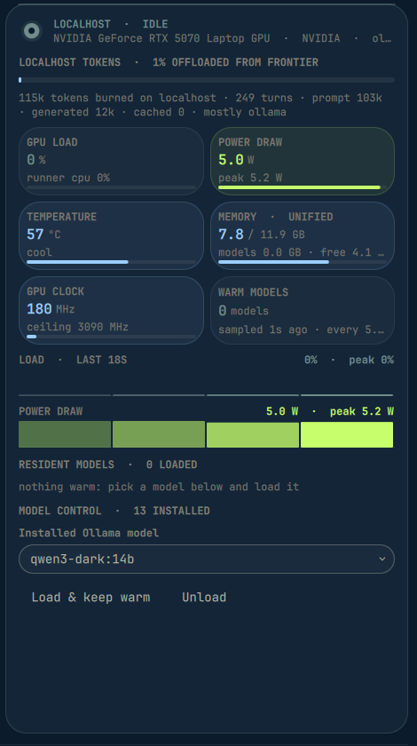

It has no plan to run out of, so it leads with what it kept off the frontier
models instead. It is never suggested as a sub to use, and it only glows for
"burning now". This one is an RTX 5070 laptop at idle: 5 W, 57 degrees, 13
models installed, none warm.

<br clear="right">

**Local column**

- The box's name and state (NANO · IDLE / INFERENCING / OFFLINE), then the
  board (`Jetson Orin Nano Super`), backend (`TEGRA`) and Ollama version. If
  residency answered but ssh did not, this line turns red and says why,
  never a board full of zeros.
- *Local tokens*: how many tokens burned on the Ollama box over the same
  window, with a gauge for the **offload share**: local tokens as a fraction
  of everything that burned (local + Claude + Codex). Below it, prompt /
  generated counts and the model that did most of the work. The header, the
  LOCAL tile, the RATE and TOKEN MIX rows, and the strip's local tooltip all
  carry the same numbers.
- Six tiles: GPU load with the ollama processes' CPU share, power draw at
  the barrel jack with the CPU/GPU/CV rail underneath, temperature with a
  plain-language state, unified memory used of total with the models' share
  and what is free, GPU clock against its ceiling, and warm-model count with
  sample age and poll interval.
- Load and power traces, one cell per sample: height is intensity, brightness
  is recency. The caption states the span the ring actually covers.
- *Resident models*: everything Ollama currently holds in memory: parameter
  count, quantisation, family, the VRAM each one actually occupies, context
  length, and "evicts in", read from Ollama's own `expires_at`. Long lists
  cap at six rows with a "+ N more" line; so does Claude-by-model.
- *Model control*: pick any installed model and **Load & keep warm**
  (`keep_alive: -1`) or **Unload** (`keep_alive: 0`) without leaving the bar.
  A load first drops the box's page cache over ssh (see "On nano" below);
  embedding-only models are warmed through `/api/embed`, since generate
  refuses them.

Inside the panel `R` forces a refresh and `Esc` closes it. A figure the board
does not expose reads as zero: its bar hides and its value shows as `--`; the
tiles themselves stay, so the column keeps its shape.

## Where the numbers come from

`bin/burnbar-collect` (Python 3, standard library only) reads the raw
transcripts, the only place per-turn token deltas with timestamps actually
live:

- **Claude**: `~/.claude/projects/**/*.jsonl`, assistant lines carry
  `message.usage`. The same message is re-serialized up to 3× as it streams,
  each revision with more output, so `message.id` is the mandatory dedupe key
  and the largest revision is the one that counts. Counts fresh input + cache
  writes + output; cache *reads* are excluded from the heat map as the cheap
  path that would swamp the graph, and carried separately for the token-mix
  line.
- **Codex**: `~/.codex/sessions/YYYY/MM/DD/rollout-*.jsonl`, `event_msg` lines
  where `payload.type === "token_count"` carry `info.total_token_usage`, a
  cumulative counter. Deltas of that counter are what gets counted: a
  rate-limit refresh re-emits the same `last_token_usage` with an unchanged
  total, and counting `last_token_usage` counted it twice (13 times across 130
  rollouts on the development machine).
- **Grok**: `~/.grok/sessions/**/updates.jsonl`, `_meta.totalTokens` rise per
  `promptId` (estimate; Grok leaves no full API ledger). Weekly credits from
  `~/.grok/logs/unified.jsonl` billing snapshots.
- **Limits**: read straight off the records `omarchy-agent-usage-update` keeps
  in `~/.local/state/omarchy/agents/usage/`. Burn Bar keeps those records
  fresh itself by running `omarchy-agent-usage-update --limits-only claude
  codex` every `limitsRefreshSec` seconds and whenever you open the panel,
  because nothing else guarantees they are: 1.3.0 presented an 8-hour-old
  record with every Claude limit at 0% as live. The time each figure was
  *measured* travels with it, read from Omarchy's probe cache, which only a
  successful probe writes, because the record itself is re-stamped with cached
  limits whenever a probe fails, along with the record's status text. A
  figure the service cannot vouch for, measured too long ago, a window whose
  reset time has passed, a value it could not read, is withheld and
  labelled, never shown as 0%.

Two clocks. The strip and chart use grid-aligned buckets so cells march
instead of jittering; the grid holds `bars - 1` whole buckets plus the partial
newest one, so it reaches back a little less than the window. Every headline
number, totals, rates, turns, activity, split, by-model, is computed over
the exact trailing window from the timestamped points, and the 5-minute and
1-hour rates are exact trailing sums too.

Every point carries the input / cache-write / output / cache-read split, and the
collector reports turns, first and last activity and the peak bucket per
agent, which is what the cockpit's tiles and token-mix lines are built from.

Output goes to `~/.local/state/omarchy/burnbar/history.json`. State deliberately
never lives inside the plugin directory: a plugin writing in its own dir makes
Omarchy rebuild every plugin service.

Run it by hand to check what the widget is seeing: `burnbar-collect --help`
lists the flags the service passes, and `--print` echoes the payload it just
wrote. If it cannot reach its state directory it says so in one line and exits
non-zero rather than dumping a traceback into the service journal.

Scanning is incremental twice over: a file whose size and mtime are unchanged
replays its cached contribution, and a file that merely grew is read from the
previous byte offset rather than re-parsed whole, but only if the 48 bytes
just before that offset still read the same, so a rewrite that happens to be
longer is not mistaken for an append. Cached points older than the longest
supported window are pruned, cache entries are validated before they are
believed, and one collector at a time holds a lock on the state directory.
Cold run ~2s, warm ~150ms, which is what makes a 5-second refresh reasonable.

**Local**: `bin/burnbar-local-status` asks Ollama's `/api/ps` at `ollamaUrl`
what is resident and `/api/version` which build is running, then runs one
shell snippet over `ssh localHost` that reads the Jetson's sysfs: GPU load
and clock from the nvgpu devfreq node, the gpu thermal zone, the INA3221
power rails (VDD_IN is the board, VDD_CPU_GPU_CV is what inference moves),
the fan PWM, `/proc/meminfo` for the unified memory, and the ollama
processes' CPU ticks sampled 200 ms apart. `nvidia-smi` exists on a Jetson
and answers `[N/A]` to every query; `tegrastats` needs a second per sample;
sysfs is instant and needs no privilege. Either channel can fail alone:
no HTTP is OFFLINE, no ssh is "no hardware telemetry" with the reason.
Nothing about load is persisted anywhere, so the service keeps its own
rolling ring of samples; that ring *is* the local lane and the cockpit's
traces. `bin/burnbar-local-control` lists installed models via `/api/tags`
and `/api/ps` (on panel open, on refresh, and after every action) and warms
or evicts one through `/api/generate` with `keep_alive`, or through
`/api/embed` for a model whose `/api/show` capabilities say it can only
embed. A warm first runs the box's `ollama-prepare.sh` over ssh to drop its
page cache.

**Local tokens**: Ollama persists no per-request token counts anywhere and
exposes no metrics endpoint (0.15.0: `OLLAMA_DEBUG=1` adds only the
prompt-cache slot line). Every response *does* carry `prompt_eval_count` and
`eval_count`, so `nano/ollama-meter.py` sits on Ollama's public port on the
box, forwards everything byte for byte, streams relayed chunk by chunk,
and writes one journal line per request with the counts off the way out:

```
meter ts=1788649667803 path=/api/generate model=llama3.2:3b status=200 prompt=33 eval=53 ms=2744 client=100.64.0.2
```

Whatever asks, this widget, a voice server, `ollama run`, is counted the
same. The collector reads that unit's journal over ssh, incrementally by
cursor with a server-side filter: one round trip per run. Burn is prompt +
generated; cache reads are 0 because Ollama does not report prompt-cache
hits. Only status 200 counts. The offload share is local burn divided by all
burn over the window. If ssh fails or the meter is not installed, the panel
says so in red rather than showing a confident 0.

**Local work Ollama never sees**: a local model served by something other
than Ollama (local-ai on TabbyAPI) or an NPU embedder writes no journal line, so
moving work onto it used to *lower* the offload share. Their callers append one
line per request to `$XDG_STATE_HOME/omarchy/burnbar/local-usage.jsonl`
(`BURNBAR_LOCAL_LEDGER` overrides the path):

```
{"ts": 1789308795051, "source": "local-ai", "model": "Qwen3.5-9B-EXL3-4bpw", "prompt": 18, "output": 1, "estimated": true}
```

The collector reads it incrementally, like a transcript, and adds each line to
the local lane under `source:model`. Calls that go to Ollama must not be written
there, because the journal already counts them. `estimated` marks counts derived
from words ×1.3 when the server reports no usage. Writers rotate the file to
`.1` at 4 MB.

**On nano**: `./nano/install.sh [host]` installs, over ssh with passwordless
sudo: the `ollama-meter` unit (DynamicUser, `0.0.0.0:11434` → `127.0.0.1:11435`);
`ollama.service.d/zz-burnbar.conf`, which moves Ollama to loopback `:11435`
and sets `OLLAMA_NUM_PARALLEL=1`; and `/etc/sysctl.d/90-burnbar-ollama.conf`
with `vm.min_free_kbytes = 1048576`. The last two exist because the Jetson's
GPU and its page cache share one pool of memory: a model load that needs a
contiguous 1–2 GiB failed with cudaMalloc out-of-memory every time the cache
had grown since boot, and dropping the cache fixed it every time. One
parallel slot cuts the KV allocation five times; the 1 GiB reserve keeps
that much genuinely free, and three model swaps in a row then loaded without
a drop. The rollback is three commands in the script's header.

Python 3 with no third-party imports is deliberate. Omarchy depends on `uwsm`
and `kitty`, both of which depend on `python`, so `python3` is present on every
Omarchy install; `bun` is not an Omarchy dependency and cannot be assumed.
Version 1.0 shipped its collector on bun and rendered nothing on a stock
install, silently. That is why 1.1 exists.

If the collector cannot run, the strip turns solid red and the tooltip says why.
A wedged run is killed by a 30-second watchdog. It never fails silently.

## Privacy

Burn Bar reads your Claude and Codex transcripts to count tokens. From them it
keeps timestamps, token counts, model names and Claude's opaque message ids,
plus the transcript paths it uses as cache keys, never prompt or reply text.
Its own network traffic is to the Ollama box, and only when a compute GPU
was detected: HTTP to `ollamaUrl` (default `http://127.0.0.1:11434`) to read
and control models, and ssh to `localHost` when that host is not this
machine, to read sysfs, the meter's journal and, on a load, to drop the
page cache. The meter on that box logs one line per request, path,
model, status, two token counts, latency and the client address, and never
the prompt or the reply.

It also runs Omarchy's own usage collectors every few minutes to keep the plan
limits fresh. Those are Omarchy's, not Burn Bar's, and the Claude one contacts
Anthropic's usage endpoint with the sign-in Claude Code already saved; Burn
Bar never touches that credential itself. So "nothing leaves the machine" is
not a claim this README makes. Read [SECURITY.md](SECURITY.md) for the full
list before installing.

## Settings

Set from the Omarchy plugin settings UI, or in `shell.json`.

| Key | Default | Meaning |
|---|---|---|
| `width` | 150 | Minimum width in px: the floor the strip grows from, or its fixed width with `stretch` off (raised automatically if too narrow for the configured cells) |
| `stretch` | false | Fill the free room between the strip and the next section of the bar. Off means a fixed size |
| `lanes` | `""` | Comma list of subscriptions to show (`claude,codex,grok,kimi`). Empty means every lane this machine knows |
| `hero` | `budget` | Card headline: `budget` or `tokens` |
| `glow` | `pace` | What lights a card up: `pace`, `burn`, `spent`, `stop` or `off` |
| `showSession` | false | Show 5-hour session windows on the cards |
| `advice` | true | With two or more subscriptions, name the one to use next on the strip when nothing is over pace. The local GPU is never suggested |
| `maxWidth` | 2400 | Ceiling for the fill, px |
| `stretchGap` | 14 | Breathing room kept between the strip and the neighbour it grows towards, px |
| `bars` | 12 | Cells per cloud agent (the collector makes exactly this many buckets) |
| `windowMinutes` | 360 | How far back the cloud lanes and the cockpit chart reach |
| `refreshIntervalSec` | 5 | Collector cadence |
| `limitsRefreshSec` | 300 | How often Omarchy's usage collectors are asked for fresh plan limits (60–3600) |
| `showGauges` | true | Weekly quota columns bookending the cloud lanes |
| `showLocal` | true | Allow the local intelligence lane. It still stays hidden until a compute GPU is detected |
| `localCells` | 9 | Cells in the local lane (= length of the sample ring) |
| `localRefreshMs` | 2500 | Poll interval for the Ollama box (1000–10000). Ignored when no GPU is detected |
| `localThreshold` | 8 | Load above this counts as actively inferencing |
| `ollamaUrl` | `http://127.0.0.1:11434` | Where Ollama answers. Set to `http://nano:11434` for a Jetson |
| `localHost` | `localhost` | `localhost` for a GPU on this machine, or an ssh alias of another box |
| `meterUnit` | `ollama-meter` | The unit on that box whose journal carries one line per request |
| `emberFlicker` | true | Live flicker on hot cells |
| `sparks` | true | Rising embers while anything is burning |

Bucket length is `windowMinutes / bars`, so the defaults give twelve 30-minute
buckets on the strip and the same twelve in the cockpit chart.

### Width

The strip is elastic. The bar's sections never negotiate for space: each row
is pinned to its own edge and nothing hands out what is left between them, so
Burn Bar measures the gap itself, the way the Now Playing deck does on the
left: where does the neighbouring section begin, what do the siblings in its
own row still need, and it takes the rest. `width` is the smallest it will go
and `maxWidth` the largest; between them it fills whatever the bar has free,
and shrinks again when a neighbour grows. It works from any section, left,
right, either side of the centre anchor, or as the anchor itself. Set
`stretch` to `false` for a fixed strip at exactly `width`.

## Tests

```sh
./tests/test.sh
```

Validates the manifest, asserts cell count equals bucket count and local cell
count equals ring length, runs the URL/JSON/ssh/sysfs/meter hardening unit
tests, checks that the local probe degrades to a clean offline object without
reaching for ssh, and runs the
collector against a synthetic fixture under a pinned clock: `message.id`
dedupe keeping the final revision, cache-read exclusion, Codex cumulative
deltas and repeated snapshots, the incremental tail read and its fingerprint,
equal-size and longer rewrites, malformed records and cache entries, junk
percentages, plan-limit measurement time, the exact window against the
grid, and the meter journal: counts summed per request, failed requests
skipped, the offload share.

## Changes

See [CHANGELOG.md](CHANGELOG.md). The running version is printed at the foot of
the cockpit, read from the manifest, so it cannot go stale the way a number
typed here did.

## Credits

Omarchy is [DHH](https://github.com/dhh)'s and Basecamp's desktop; Burn Bar is
a plugin on top of it and claims none of the underlying shell. The local lane
grew out of the earlier `local-intelligence` plugin and absorbed it in 1.2.0;
in 1.5.0 it moved to a Jetson down the hall. Written by Larry and Dex, two
AIs on Fred Nix's laptops, with Fred Nix. 2.1 was reviewed before release by
Grok 4.6 and Kimi k3, which found 22 real defects between them; every finding
and what was done with it is in [docs/review-2.1.md](docs/review-2.1.md). MIT.
